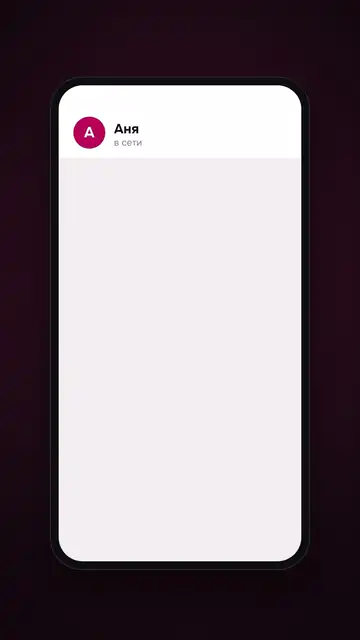
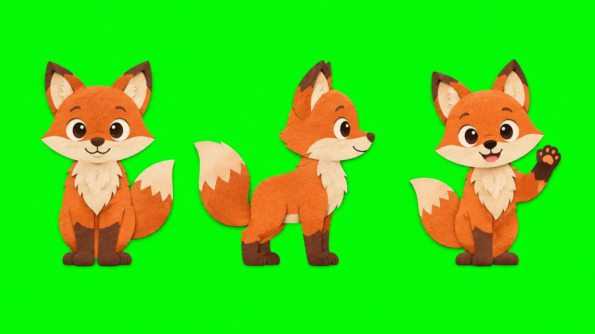
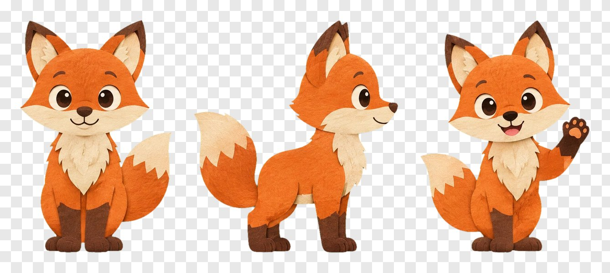
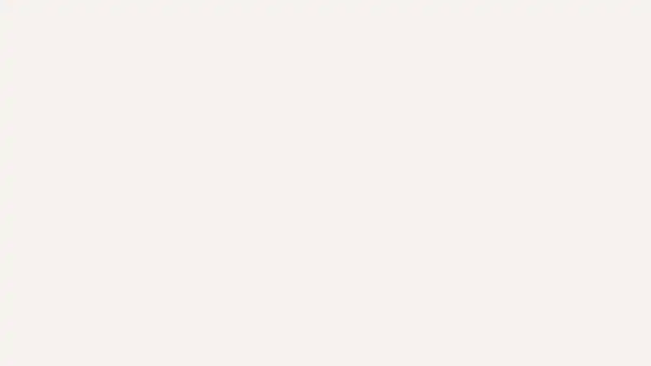

# motion-video — монтаж и моушен кодом для агента

**Скилл для Claude Code, Codex и других агентов:** рекламные ролики, моушен-дизайн, презентации и монтаж из отснятых
клипов — собранные кодом (HTML/CSS/GSAP → MP4 на движке [HyperFrames](https://github.com/heygen-com/hyperframes)).
Пять форматов, три уровня проработки, субтитры по таймингам голоса, синтез звуков, микс с вырезом частот под голос,
и главное — **правка перерисовывает только изменённые куски**: титр поправить — минута, звук — секунды.

<table>
<tr>
<td width="25%"><br><sub><b>Бумажная перекладка</b>: лиса из image-gen, вырезка <code>cutout.py</code>, стоп-моушен 12 рисунков/с — <a href="docs/demo-paper.mp4">MP4 со звуком</a></sub></td>
<td width="25%"><br><sub><b>Кинетическая типографика</b>, шаблон <code>kinetic-type</code> — <a href="docs/demo-kinetic.mp4">MP4</a></sub></td>
<td width="25%"><br><sub><b>История в переписке</b>, шаблон <code>chat-ui</code> — <a href="docs/demo-chat.mp4">MP4</a></sub></td>
<td width="25%"><br><sub>Картинка из image-gen на #00FF00…</sub><br><br><br><sub>…и спрайты после <code>cutout.py cut</code></sub></td>
</tr>
<tr>
<td colspan="4"><br><sub><b>Спокойная презентация 16:9</b>, шаблон <code>explainer</code> — <a href="docs/demo-explainer.mp4">MP4</a>. Шаблоны показаны как есть, без доработки: это стартовые скелеты, уровень «премиум» собирается поверх них (см. <a href="references/cases/">разборы</a>).</sub></td>
</tr>
</table>

> **English.** Agent skill for code-built video: ads from footage with animated captions, motion ads, explainers,
> chat/UI stories, kinetic type, photo montage and paper cut-out cartoons — HTML/CSS/GSAP rendered by a pinned,
> sandboxed HyperFrames. Incremental re-render of changed segments only, sound-only edits in seconds, synthesized SFX,
> voice-aware mixing, QA tools and a per-video making-of journal. Docs are in Russian; agents read them fine.

## Что умеет

| | |
|---|---|
| 🎬 Форматы | 9:16, 4:5, 1:1, 16:9, 3:4 — безопасные поля и кегли под каждый |
| 🧩 Шаблоны | `footage-ad` (монтаж из клипов), `explainer`, `chat-ui`, `kinetic-type`, `photo-editorial`, `blank` |
| 🎚 Три уровня | простой, средний, премиум (камера, глубина резкости, свет, звук из физики движения) |
| ⚡ Быстрые правки | кэш по отпечаткам кадров: перерисовка только изменённых 2-секундных кусков; звук — без рендера картинки |
| 💬 Субтитры | 6 стилей по таймингам слов голоса, авто-уход под перебивки |
| 🔊 Звук | синтез SFX (бесплатно, с вариативностью), генерация и выравнивание музыки по дропу, микс −14 LUFS |
| 🗣 Голос | через скилл [elevenlabs-voice](https://github.com/artemmarketolog/elevenlabs-voice): кэш, темп, точечная замена слова |
| 🖼 Картинки | через скилл [image-gen](https://github.com/artemmarketolog/image-gen); вырезка спрайтов и букв с хромакея |
| 🎥 Банк кадров | каталогизация отснятых клипов, нарезка на фазы, «кадр под фразу», Google Drive-помощники |
| ✅ Проверки | lint/check композиции, QA мастера, контактные листы, проверка звука, ASR-сверка речи |
| 📒 История ролика | `MAKING-OF.md` и указатель студии: любой агент поправит или повторит ролик в новой сессии |
| 🔒 Песочница | рендер в bubblewrap без сети и без доступа к домашней папке |

## Три связанных скилла

```
~/.claude/skills/            (или ~/.agents/skills/)
├── motion-video/      ← монтаж, анимация, звук, рендер — этот репозиторий
├── elevenlabs-voice/  ← озвучка (нужна для роликов с голосом)
└── image-gen/         ← картинки (нужна для роликов из генераций)
```

Монтаж, анимация и синтез звуков работают без ключей. Голос и картинки подключаются, когда соседние скиллы стоят рядом.

## Установка

**Попросите своего агента:**

> Установи скиллы https://github.com/artemmarketolog/motion-video, https://github.com/artemmarketolog/elevenlabs-voice
> и https://github.com/artemmarketolog/image-gen рядом в папку скиллов, в каждом запусти `python3 setup.py`, затем
> дымовой тест motion-video, и скажи, куда вписать ключи.

**Вручную:**

```bash
cd ~/.claude/skills            # Claude Code; для Codex и других — ~/.agents/skills
git clone https://github.com/artemmarketolog/motion-video
git clone https://github.com/artemmarketolog/elevenlabs-voice
git clone https://github.com/artemmarketolog/image-gen
for s in motion-video elevenlabs-voice image-gen; do (cd $s && python3 setup.py); done
motion-video/.venv/bin/python motion-video/scripts/smoke_test.py --out /tmp/motion-smoke-1   # ~10 мин, без трат
```

`setup.py` motion-video ставит всё сам: Python-окружение, закреплённый движок HyperFrames 0.8.84 (`npm ci` без
install-скриптов), Chrome for Testing 149, конфиг `~/.config/media-skills/motion-video.env` и папку студии `~/video-studio`.

**Что нужно в системе** (Linux или WSL2; на macOS работают все шаги кроме рендера):

```bash
sudo apt install -y python3 python3-venv ffmpeg bubblewrap nodejs npm   # Node.js 22+ (nodesource, nvm или fnm)
# зависимости Chrome на «голом» сервере:
sudo apt install -y libnss3 libatk-bridge2.0-0 libgbm1 libxkbcommon0 libasound2t64 libxcomposite1 libxdamage1 libxrandr2 libpango-1.0-0 libcairo2
```

Кэш кусков старых роликов можно чистить раз в сутки (ролики, которые 2 суток не трогали):
`( crontab -l 2>/dev/null; echo "40 4 * * * $HOME/.claude/skills/motion-video/scripts/cache_gc.sh" ) | crontab -`.

Проверка среды: `python3 setup.py --check`. Если bubblewrap не стартует (Ubuntu 24.04 ограничивает user namespaces
через AppArmor) — см. [references/runtime.md](references/runtime.md).

**Ключи** — только для платных шагов, в `~/.config/media-skills/`:
- голос и музыка — `ELEVEN_API_KEY` (берётся из `elevenlabs-voice.env`, отдельно вписывать не нужно);
- картинки — `LAOZHANG_API_KEY` в `image-gen.env`;
- необязательная ASR-сверка речи — `OPENAI_API_KEY` в `motion-video.env`.

## Как пользоваться

Пишите агенту: «сделай моушен-рекламу 15 секунд для кофейни, оффер — второй кофе в подарок», «смонтируй рилс из этих
клипов с субтитрами», «собери презентацию 16:9 из этих тезисов», «в ролике сделай музыку тише и поменяй титр на 8-й
секунде». Агент определит тип и уровень, предложит сценарий, при премиуме покажет стилевой кадр, соберёт, проверит
кадры и отдаст мастер.

Сам конвейер:

```bash
S=~/.claude/skills/motion-video/scripts; PY=~/.claude/skills/motion-video/.venv/bin/python
V=~/video-studio/projects/acme-01
$PY $S/new_project.py $V --template kinetic-type --format 9:16
cd $V && $PY build.py && $PY $S/hf.py $V check --json
$PY $S/preview.py $V --at 0,2,4,6 --name v1                              # лист превью до рендера
$PY $S/mv.py build $V -o output/master-r1.mp4 --note "первая сборка"     # рендер
# правка: поменяли текст в build.py
$PY build.py && $PY $S/mv.py plan $V                                     # что перерисуется
$PY $S/mv.py build $V -o output/master-r2.mp4 --note "новый титр"        # только изменённые куски
$PY $S/mv.py audio $V -o output/master-r3.mp4 --note "музыка тише"       # звук за секунды
```

Полное руководство для агента — [SKILL.md](SKILL.md). Справочники: режиссура, типографика, субтитры, звук, микс,
сценарии для рекламы, банк кадров, варианты под города, разборы эталонных роликов — [references/](references/).

## Скорость (сервер 6 ядер, без GPU)

| Действие | Время |
|---|---|
| Первая сборка ролика 12 с, Full HD | 1,5–2 мин |
| Правка одного титра | ~1 мин (перерисованы 2 куска из 3) |
| Правка только звука | 4–20 с, картинка не рендерится |
| Тяжёлая премиум-сцена 40 с (3D, бумажная перекладка) | 15–25 мин |

## Ваши данные остаются у вас

| Что | Где |
|---|---|
| Ролики, указатель, клиенты, банк кадров | `~/video-studio/` (`MOTION_VIDEO_STUDIO`) |
| Журнал всех сборок | `~/.local/share/motion-video/ledger.jsonl` |
| Движок и браузер | `~/.local/share/motion-video/runtime/` |
| Кэш озвучки и рендера | `~/.local/share/motion-video/`, `~/.cache/motion-video/` |
| Ключи | `~/.config/media-skills/*.env` (chmod 600) |

В репозитории нет чужих роликов, голосов и журналов: у каждого пользователя всё начинается с пустой студии.
Рендер идёт локально в песочнице без сети. Подробно: [SECURITY.md](SECURITY.md).

## Лицензии

Код скилла — MIT ([LICENSE](LICENSE)). HyperFrames и библиотека рецептов `references/upstream/` — Apache-2.0
(© HeyGen, [LICENSE](references/upstream/LICENSE)). GSAP ставится из npm по собственной лицензии GreenSock
([runtime/GSAP-LICENSE.txt](runtime/GSAP-LICENSE.txt)). Шрифты в `assets/fonts/` — SIL OFL 1.1 ([список](assets/fonts/LICENSES.md)).
